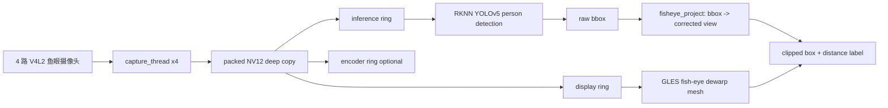

# RK3568 四路鱼眼 AI 安防摄像头

本项目运行在 RK3568 ARM Linux 板卡上，接入 4 路 1920x1080@25fps NV12 鱼眼摄像头，实现实时采集、Wayland/GLES2 显示、RKNN YOLOv5 人体检测、鱼眼矫正视图、人体框投影、粗略距离估计，并保留可选 H.265 硬编码能力。

当前推荐演示版本是：

```text
branch: codex/security-fisheye-ai
mode:   /userdata/start_security.sh
model:  /userdata/yolov5.rknn
calib:  /userdata/calib/calib_video0-3.yaml
```

稳定基线仍保留在 `codex/stable-4ch-ai-enc-display`，安全鱼眼 AI 功能在 `codex/security-fisheye-ai` 分支继续开发，不影响稳定版本。

## 当前能力

| 模块 | 当前状态 | 说明 |
| --- | --- | --- |
| 四路采集 | 可用 | `/dev/video0-3`，1920x1080 NV12，25fps |
| 四路显示 | 可用 | Wayland + EGL + GLES2，默认 2x2 安防监控布局 |
| 鱼眼矫正 | 可用 | 读取 `/userdata/calib/calib_videoN.yaml`，GLES mesh 矫正显示 |
| 人体检测 | 可用 | RKNN YOLOv5，4 路 round-robin 推理 |
| 检测框映射 | 可用 | 原始鱼眼检测框投影到矫正视图，并做可见性裁剪 |
| 距离估计 | Demo 级 | 假设人身高 1.70m，根据检测框顶部/底部射线角度估算距离 |
| 距离显示 | 可用 | 框内小型 `1.5m` 标签，另有 `[DIST]` 日志 |
| H.265 编码 | 可用但非默认 | 编码会增加 DDR/MPP/GPU 压力，安防 demo 默认关闭 |
| AVM/OEM UI | 原型保留 | 不是当前主路线，真实 360 拼接还需外参/IPM/融合 |

## 快速运行

板端推荐直接运行：

```bash
cd /userdata
./start_security.sh
```

脚本会检查：

- `/userdata/rk3568_camera`
- `/userdata/yolov5.rknn`
- `/userdata/calib/calib_video0.yaml`
- `/userdata/calib/calib_video1.yaml`
- `/userdata/calib/calib_video2.yaml`
- `/userdata/calib/calib_video3.yaml`

默认参数：

```bash
SECURITY_MODE=1
FISHEYE_CALIB_DIR=/userdata/calib
FISHEYE_FOV=150,150,150,150
SECURITY_PERSON_HEIGHT_M=1.70
SECURITY_WARN_NEAR_M=1.50
SECURITY_WARN_MID_M=3.00
```

可临时覆盖，例如：

```bash
FISHEYE_FOV=155,155,155,155 ./start_security.sh
SECURITY_PERSON_HEIGHT_M=1.75 ./start_security.sh
SECURITY_VIEW_YAW=0,0,0,0 SECURITY_VIEW_PITCH=0,0,0,0 ./start_security.sh
```

## 其他启动脚本

```bash
/userdata/start_ai.sh          # 四路 AI + 2x2 显示，不开编码
/userdata/start_ai_enc.sh      # 四路 AI + H.265 编码
/userdata/start_avm.sh         # 旧 AVM/OEM UI 原型
/userdata/start_avm_enc.sh     # 旧 AVM/OEM UI 原型 + 编码
```

当前安全鱼眼 AI demo 推荐 `start_security.sh`，因为它默认不开编码，优先保证显示、检测和测距稳定。

## 实测性能

最近板端测试结果：

```text
Capture fps: ch0=25.0 ch1=25.0 ch2=25.0 ch3=25.0
Display fps: 26-29
Inference: total=14-16/s
Per-camera inference: about 3.5-4/s per channel
Detection latency: about 60-70 ms
```

含义：

- 显示是实时流畅的，四路画面持续刷新。
- AI 是四路轮询推理，总吞吐约 14-16 FPS。
- 每路 AI 更新约 3.5-4 FPS，适合人员检测、安全提示和 demo，不适合高速目标连续跟踪。

## 数据流



目前 display、infer、encoder 都拿 packed NV12 稳定副本，避免 V4L2 buffer 归还后仍被读取导致闪烁或崩溃。代价是内存带宽和 CPU 拷贝压力上升，所以编码打开后帧率会下降。

## 鱼眼矫正与框映射

当前检测仍在原始鱼眼图上执行，YOLO 输出的是原始 1920x1080 坐标。显示层使用同一套鱼眼模型把检测框投影到矫正视图：

```text
raw bbox edge points
    -> fisheye inverse projection
    -> camera rays
    -> virtual pinhole view
    -> corrected view bbox
    -> visible-area clipping
```

为避免框跑出画面，当前策略是：

- 只统计投影后落在当前矫正视图内的点。
- 可见比例低于阈值的框不显示。
- 显示框被限制在当前 2x2 tile 内。

这个策略适合产品展示，因为“少显示边缘不完整框”比“显示一个越界大框”更可信。

## 距离估计 Demo

当前距离估计是单目近似方案，不依赖外参，适合 demo：

```text
假设人高 H = 1.70m
检测框顶部中心点 -> 相机射线 A
检测框底部中心点 -> 相机射线 B
角高度 theta = angle(A, B)
距离约 D = H / (2 * tan(theta / 2))
```

画面显示小型距离标签，例如：

```text
1.5m
2.3m
```

终端日志也会输出：

```text
[DIST] cam0 visible_person=2 nearest=1.51m method=height1.70m
```

限制：

- 人不一定刚好 1.70m。
- 人弯腰、遮挡、只露上半身会导致距离偏差。
- YOLO 框高度波动会直接影响距离。
- 当前未使用安装高度、俯仰角、地面平面，因此不是工程级测距。

最终产品应升级为外参/地面平面方案：

```text
bbox foot point -> fish-eye ray -> ground-plane intersection -> real distance
```

## 分支说明

| 分支/标签 | 用途 |
| --- | --- |
| `codex/security-fisheye-ai` | 当前安全鱼眼 AI 开发分支，包含矫正、框映射、距离 demo |
| `codex/stable-4ch-ai-enc-display` | 稳定基线，四路显示 + AI + 编码 |
| `stable-4ch-ai-enc-display-20260527` | 稳定基线标签，便于回退 |
| `main` | 早期主线 |

切回稳定版本：

```bash
git checkout codex/stable-4ch-ai-enc-display
```

切回当前安全鱼眼 AI 版本：

```bash
git checkout codex/security-fisheye-ai
```

## 构建与部署

在 Linux VM 中：

```bash
cd /home/rrn/rk3568-camera
source /home/rrn/3568/3568_sdk/environment-setup
make -j4
adb push rk3568_camera /userdata/rk3568_camera
adb shell chmod +x /userdata/rk3568_camera
adb push start_security.sh /userdata/start_security.sh
adb shell chmod +x /userdata/start_security.sh
```

运行：

```bash
adb shell
cd /userdata
./start_security.sh
```

## 当前不足

1. `src/display.c` 仍然过大，基础显示、旧 AVM、安全模式、OSD 都混在一起，后续应拆分。
2. 当前距离是身高估算 demo，不是正式测距。
3. 每路推理约 3.5-4 FPS，适合安防检测，不适合高速跟踪。
4. 当前矫正视图仍是单虚拟视角；后续产品化建议做多虚拟视角或全景展开。
5. 编码和 AI 同开会明显增加系统压力，默认安全 demo 不开编码。

## 推荐对外表述

可以这样介绍：

> 当前系统已完成 RK3568 四路鱼眼 AI 安防 demo：四路实时显示、鱼眼矫正、人体检测、检测框映射、基于人体高度的粗略距离估计。系统显示保持实时，AI 四路轮询，总推理约 14-16 FPS。距离估计当前为 demo 级方案，后续会结合相机安装高度、俯仰角和地面平面外参升级为工程级测距。

不要说：

> 已完成高精度测距。

也不要说：

> 已完成原厂级 360 AVM 拼接。

当前更准确的定位是：

```text
四路鱼眼 AI 安防监控 demo + 初版单目测距
```

## 文档入口

- [项目技术总结](docs/PROJECT_TECH_SUMMARY_CN.md)
- [运行手册](docs/RUNBOOK.md)
- [当前状态](docs/STATUS.md)
- [架构说明](docs/ARCHITECTURE.md)
- [后续任务](docs/TODO.md)
