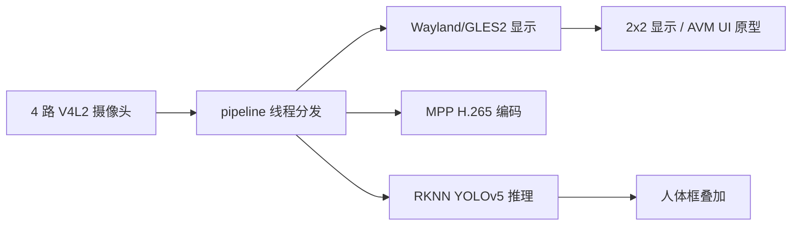
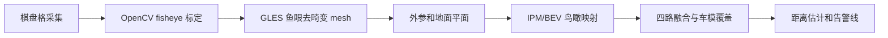

# RK3568 四路 AI 摄像头与 AVM 原型

本项目运行在 RK3568 ARM Linux 板卡上，面向四路 1920x1080@25fps NV12 摄像头，实现实时采集、Wayland/GLES2 显示、RKNN YOLOv5 人体检测，并支持可选 MPP H.265 硬编码。

当前项目分为两条路线：

- **稳定安防路线**：四路采集、2x2 实时显示、人体检测、可选编码录制。
- **AVM 原型路线**：OEM 风格界面和视角切换已接入，但真实 360 环视拼接还需要鱼眼标定、去畸变、IPM/BEV 映射和融合。

## 当前能力

| 模块 | 状态 | 说明 |
|------|------|------|
| 四路 V4L2 采集 | 已完成 | `/dev/video0-3`，1920x1080 NV12，MMAP/dma_buf |
| 2x2 实时显示 | 已完成 | Wayland + EGL + GLES2，NV12 shader 显示 |
| RKNN 人体检测 | 已完成 | YOLOv5 RKNN，四路 round-robin 推理，人体框叠加 |
| MPP H.265 编码 | 可用 | 四路编码可运行，但会增加 DDR/MPP/GPU 压力 |
| OEM AVM UI | 原型 | 支持键盘/鼠标切换界面和辅助线，不等于真实拼接 |
| 鱼眼矫正/BEV 拼接 | 待标定 | 需要正式采集棋盘格数据后推进 |
| 人员距离估计 | 待实现 | 依赖鱼眼标定、地面平面映射和坐标换算 |

## 版本说明

| 分支/标签 | 用途 |
|-----------|------|
| `codex/stable-4ch-ai-enc-display` | 当前推荐稳定基线，四路显示 + AI + 编码能力相对可靠 |
| `stable-4ch-ai-enc-display-20260527` | 稳定基线标签，方便随时回退 |
| `codex/oem-avm-ui` | AVM/OEM UI 开发分支，适合继续做界面、标定和拼接实验 |
| `main` | 早期主线 |

## 板端快速运行

推荐使用 `/userdata` 下的启动脚本：

```bash
# 四路 AI，不开编码，推荐调试
/userdata/start_ai.sh

# 四路 AI + H.265 编码
/userdata/start_ai_enc.sh

# AVM/OEM UI 原型，不开编码
/userdata/start_avm.sh

# AVM/OEM UI 原型 + H.265 编码
/userdata/start_avm_enc.sh
```

模型路径默认使用：

```bash
/userdata/yolov5.rknn
```

## 技术路线



后续真实 AVM 路线：



## 与原厂 AVM 的差距

原厂 360 AVM 通常包含完整标定、去畸变、鸟瞰变换、拼接融合、车模遮罩和距离辅助线。本项目目前已经具备四路实时视频和 AI 检测基础，但还没有完成正式标定和 BEV 拼接，所以当前 AVM 只能作为 UI/交互原型，不能称为原厂级 360 环视。

## 文档入口

- [项目技术总结](docs/PROJECT_TECH_SUMMARY_CN.md)
- [运行手册](docs/RUNBOOK.md)
- [当前状态](docs/STATUS.md)
- [架构说明](docs/ARCHITECTURE.md)
- [后续任务](docs/TODO.md)
