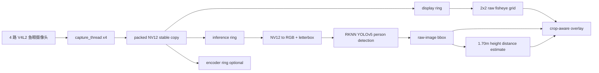

# RK3568 四路鱼眼 AI 安防摄像头

本项目运行在 RK3568 ARM Linux 板卡上，接入 4 路 1920x1080@25fps NV12 鱼眼摄像头，实现实时采集、Wayland/GLES2 显示、RKNN YOLOv5 人体检测、检测框显示和 demo 级距离估计，并保留可选 H.265 硬编码能力。

当前推荐演示版本是“鱼眼原图坐标优先”的安防方案：

```text
branch: codex/security-fisheye-height-crop80
script: /userdata/start_security_fisheye_height.sh
model:  /userdata/yolov5.rknn
calib:  /userdata/calib/calib_video0-3.yaml
view:   2x2 raw fisheye grid, center crop 80%
```

这版的核心取舍是：显示和 RKNN 都使用同一套鱼眼原图坐标，避免“鱼眼原图检测框投影到矫正画面”造成的框漂移。画面通过中心 80% 裁切降低鱼眼边缘畸变感，检测框和距离标签仍按同一裁切比例映射。

稳定基线仍保留在 `codex/stable-4ch-ai-enc-display`，标签为 `stable-4ch-ai-enc-display-20260527`。该稳定版不要用于继续实验，后续安防测距和 UI 修改都应在独立分支上进行。

## 当前能力

| 模块 | 当前状态 | 说明 |
| --- | --- | --- |
| 四路采集 | 可用 | `/dev/video0-3`，1920x1080 NV12，25fps |
| 四路显示 | 可用 | Wayland + EGL + GLES2，默认 2x2 安防监控布局 |
| 鱼眼标定读取 | 可用 | 读取 `/userdata/calib/calib_videoN.yaml`，供内参、焦距和后续矫正/测距使用 |
| 当前推荐显示 | 可用 | 鱼眼原图 2x2 显示，中心裁切 80%，减少边缘畸变观感 |
| 人体检测 | 可用 | RKNN YOLOv5，4 路 round-robin 推理，person-only |
| 检测框显示 | 可用 | 当前推荐版检测和显示同坐标，框位置比矫正投影方案稳定 |
| 距离估计 | Demo 级 | 当前推荐版按 1.70m 人体高度和相机内参焦距粗估距离 |
| H.265 编码 | 可用但非默认 | 编码会增加 DDR/MPP/GPU 压力，安防 demo 默认关闭 |
| AVM/OEM UI | 原型保留 | 不是当前主路线，真实 360 拼接还需外参、IPM/BEV 和融合 |

## 快速运行

板端推荐直接运行：

```bash
cd /userdata
./start_security_fisheye_height.sh
```

脚本会检查：

- `/userdata/rk3568_camera`
- `/userdata/yolov5.rknn`
- `/userdata/calib`

默认关键参数：

```bash
INFER_FLIPY=1,1,1,1
SECURITY_PERSON_HEIGHT_M=1.70
SECURITY_RAW_CROP=0.80
SECURITY_INFER_CONF=0.50
SECURITY_PERSON_CONF=0.50
SECURITY_DISPLAY_FPS=25
```

可临时覆盖，例如：

```bash
SECURITY_RAW_CROP=0.90 ./start_security_fisheye_height.sh
SECURITY_PERSON_HEIGHT_M=1.75 ./start_security_fisheye_height.sh
SECURITY_INFER_CONF=0.55 SECURITY_PERSON_CONF=0.55 ./start_security_fisheye_height.sh
```

## 推荐版本与回退

当前推荐安防 demo：

```bash
git checkout codex/security-fisheye-height-crop80
```

回到稳定基线：

```bash
git checkout codex/stable-4ch-ai-enc-display
```

重要分支：

| 分支/标签 | 用途 |
| --- | --- |
| `codex/security-fisheye-height-crop80` | 当前推荐 demo，raw 鱼眼显示 + 80% 裁切 + 原图框 + 身高估距 |
| `codex/raw-infer-footpoint-distance` | 当前推荐方案的开发来源分支 |
| `codex/rectified-direct-stable` | 矫正后图像直接推理实验版，框对齐好但推理更新更慢 |
| `codex/stable-4ch-ai-enc-display` | 稳定基线，四路显示 + AI + 编码能力 |
| `stable-4ch-ai-enc-display-20260527` | 稳定基线标签，便于回退 |

## 实测性能

当前推荐脚本最近板端测试：

```text
Capture fps: ch0=25.0 ch1=25.0 ch2=25.0 ch3=25.0
Display fps: 24.8-25.0
Inference: total=16.4-16.6/s
Per-camera inference: about 4.0-4.2/s per channel
Detection latency: about 58-65 ms
```

含义：

- 四路画面按 25fps 刷新，显示流畅。
- AI 是四路轮询推理，总吞吐约 16fps。
- 每路 AI 更新约 4fps，适合安防检测、人员提示和 demo，不适合高速目标连续跟踪。
- 当前推荐版默认不开编码，避免 MPP 编码带来的额外系统压力。

## 数据流



目前 display、infer、encoder 都拿 packed NV12 稳定副本，避免 V4L2 buffer 归还后仍被读取导致闪烁或崩溃。代价是内存带宽和 CPU 拷贝压力上升，所以编码打开后帧率会下降。

## 为什么当前选择 raw 鱼眼方案

我们测试过两条路线：

1. 鱼眼原图推理，然后把框投影到矫正画面。
2. 矫正后图像直接推理。

第一条在边缘、头顶、手脚处容易漂移，因为 YOLO 框是矩形，而鱼眼到矫正图不是线性矩形变换。第二条框坐标更干净，但每次推理前要做矫正采样，总推理帧率更低，走动时框更容易追不上。

当前推荐版选择第三种更稳的 demo 路线：

```text
显示 raw 鱼眼图
RKNN 也看 raw 鱼眼图
框直接画在 raw 图坐标上
显示层只做统一中心裁切
```

这样牺牲了一部分画面观感，但框和画面同坐标，运行也更流畅。对当前安防 demo 来说，这是目前最可控的一版。

## 距离估计 Demo

当前推荐版距离估计是 demo 级身高反推：

```text
假设人高 H = 1.70m
使用相机内参焦距 f
使用检测框高度 h
距离 D ≈ H * f / h
```

画面中会在检测框附近显示小型距离标签，例如：

```text
1.5m
2.3m
```

限制必须说明清楚：

- 人不一定刚好 1.70m。
- 人弯腰、遮挡、只露上半身会导致距离偏差。
- YOLO 框高度波动会直接影响距离。
- 当前不是正式工程级测距，只能用于 demo 和趋势判断。

最终产品应升级为外参/地面平面方案：

```text
bbox foot point -> fish-eye ray -> ground-plane intersection -> real distance
```

这需要每个摄像头的安装高度、俯仰角、朝向和实测距离样本。

## 其他启动脚本

```bash
/userdata/start_ai.sh                    # 四路 AI + 2x2 显示，不开编码
/userdata/start_ai_enc.sh                # 四路 AI + H.265 编码
/userdata/start_security_fisheye_height.sh # 当前推荐安防 demo
/userdata/start_security_rectified.sh    # 矫正后直接推理实验版
/userdata/start_security_rawfoot.sh      # raw 脚点/外参实验版
/userdata/start_avm.sh                   # 旧 AVM/OEM UI 原型
/userdata/start_avm_enc.sh               # 旧 AVM/OEM UI 原型 + 编码
```

## 构建与部署

在 Linux VM 中：

```bash
cd /home/rrn/rk3568-camera
source /home/rrn/3568/3568_sdk/environment-setup
make -j4
adb push rk3568_camera /userdata/rk3568_camera
adb shell chmod +x /userdata/rk3568_camera
adb push start_security_fisheye_height.sh /userdata/start_security_fisheye_height.sh
adb shell chmod +x /userdata/start_security_fisheye_height.sh
```

运行：

```bash
adb shell
cd /userdata
./start_security_fisheye_height.sh
```

## 当前不足

1. 当前推荐版为 raw 鱼眼显示，画面观感不如矫正图，但框坐标更稳。
2. 身高估距只是 demo 方案，不能作为高精度距离结论。
3. 每路推理约 4fps，适合安防提示，不适合高速连续跟踪。
4. 真实 AVM 仍未完成，原厂级 360 需要外参、IPM/BEV、拼接缝融合和 UI 资产。
5. `src/display.c` 仍然过大，基础显示、旧 AVM、安全模式、OSD 都混在一起，后续应拆分。

## 推荐对外表述

可以这样介绍：

> 当前系统已完成 RK3568 四路鱼眼 AI 安防 demo：四路实时显示、RKNN YOLOv5 人体检测、检测框显示、基于 1.70m 人体高度的粗略距离估计。当前推荐版采用 raw 鱼眼显示和 raw 坐标检测，保证框位置稳定，并通过中心 80% 裁切改善鱼眼边缘观感。系统显示保持 25fps，AI 四路轮询总推理约 16fps。

不要说：

> 已完成高精度测距。

也不要说：

> 已完成原厂级 360 AVM 拼接。

当前更准确的定位是：

```text
四路鱼眼 AI 安防监控 demo + 初版单目身高估距
```

## 文档入口

- [项目状态](docs/STATUS.md)
- [运行手册](docs/RUNBOOK.md)
- [项目技术总结](docs/PROJECT_TECH_SUMMARY_CN.md)
