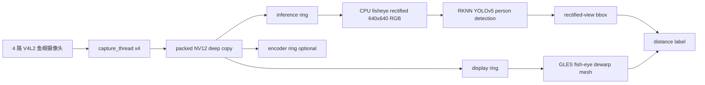

# RK3568 四路鱼眼 AI 安防摄像头

本项目运行在 RK3568 ARM Linux 板卡上，接入 4 路 1920x1080@25fps NV12 鱼眼摄像头，实现实时采集、Wayland/GLES2 显示、鱼眼矫正视图、RKNN YOLOv5 矫正后人体检测、粗略距离估计，并保留可选 H.265 硬编码能力。

当前推荐演示版本是：

```text
branch: codex/rectified-direct-stable
mode:   /userdata/start_security_rectified.sh
model:  /userdata/yolov5.rknn
calib:  /userdata/calib/calib_video0-3.yaml
```

稳定基线仍保留在 `codex/stable-4ch-ai-enc-display`。安全鱼眼 AI 的上一版保留在 `codex/security-fisheye-ai`，当前矫正后直接推理实验版在 `codex/rectified-direct-stable`，不影响稳定版本。

## 当前能力

| 模块 | 当前状态 | 说明 |
| --- | --- | --- |
| 四路采集 | 可用 | `/dev/video0-3`，1920x1080 NV12，25fps |
| 四路显示 | 可用 | Wayland + EGL + GLES2，默认 2x2 安防监控布局 |
| 鱼眼矫正 | 可用 | 读取 `/userdata/calib/calib_videoN.yaml`，GLES mesh 矫正显示 |
| 人体检测 | 可用 | RKNN YOLOv5，4 路 round-robin 推理 |
| 检测框映射 | 可用 | 推荐版为矫正后图像直接推理，检测框天然对齐矫正视图 |
| 距离估计 | Demo 级 | 优先使用相机高度/俯仰角估算地面距离，配置缺失时回退 1.70m 人体高度估算 |
| 距离显示 | 可用 | 框内小型 `1.5m` 标签，另有 `[DIST]` 日志 |
| H.265 编码 | 可用但非默认 | 编码会增加 DDR/MPP/GPU 压力，安防 demo 默认关闭 |
| AVM/OEM UI | 原型保留 | 不是当前主路线，真实 360 拼接还需外参/IPM/融合 |

## 快速运行

板端推荐直接运行：

```bash
cd /userdata
./start_security_rectified.sh
```

脚本会检查：

- `/userdata/rk3568_camera`
- `/userdata/yolov5.rknn`
- `/userdata/calib/calib_video0.yaml`
- `/userdata/calib/calib_video1.yaml`
- `/userdata/calib/calib_video2.yaml`
- `/userdata/calib/calib_video3.yaml`

默认参数：

```bash
SECURITY_MODE=1
RECTIFIED_INFER=1
FISHEYE_CALIB_DIR=/userdata/calib
FISHEYE_FOV=150,150,150,150
SECURITY_PERSON_HEIGHT_M=1.70
SECURITY_CAMERA_HEIGHTS=from /userdata/calib/security_extrinsics.ini
SECURITY_CAMERA_PITCHES=from /userdata/calib/security_extrinsics.ini
SECURITY_WARN_NEAR_M=1.50
SECURITY_WARN_MID_M=3.00
```

可临时覆盖，例如：

```bash
FISHEYE_FOV=155,155,155,155 ./start_security_rectified.sh
SECURITY_PERSON_HEIGHT_M=1.75 ./start_security_rectified.sh
SECURITY_CAMERA_HEIGHTS=1.20,1.20,1.20,1.20 SECURITY_CAMERA_PITCHES=35,35,35,35 ./start_security_rectified.sh
SECURITY_VIEW_YAW=0,0,0,0 SECURITY_VIEW_PITCH=0,0,0,0 ./start_security_rectified.sh
```

## 其他启动脚本

```bash
/userdata/start_ai.sh          # 四路 AI + 2x2 显示，不开编码
/userdata/start_ai_enc.sh      # 四路 AI + H.265 编码
/userdata/start_avm.sh         # 旧 AVM/OEM UI 原型
/userdata/start_avm_enc.sh     # 旧 AVM/OEM UI 原型 + 编码
```

当前安全鱼眼 AI demo 推荐 `start_security_rectified.sh`，因为它默认不开编码，并让 RKNN 直接看矫正后的图像，检测框更容易和显示画面对齐。

## 实测性能

最近板端测试结果：

```text
Capture fps: ch0=25.0 ch1=25.0 ch2=25.0 ch3=25.0
Display fps: 26-29
Inference: total=14/s
Per-camera inference: about 3.4-3.6/s per channel
Detection latency: about 65-75 ms
```

含义：

- 显示是实时流畅的，四路画面持续刷新。
- AI 是四路轮询推理，总吞吐约 14-16 FPS。
- 每路 AI 更新约 3.5-4 FPS，适合人员检测、安全提示和 demo，不适合高速目标连续跟踪。

## 数据流



目前 display、infer、encoder 都拿 packed NV12 稳定副本，避免 V4L2 buffer 归还后仍被读取导致闪烁或崩溃。代价是内存带宽和 CPU 拷贝压力上升，所以编码打开后帧率会下降。

## 鱼眼矫正与框映射

当前推荐版检测直接在矫正后的图像上执行。预处理阶段使用标定参数把每路 NV12 鱼眼图采样成模型输入大小的矫正 RGB 图，YOLO 输出再映射回 1920x1080 的矫正视图坐标：

```text
fish-eye NV12
    -> calibrated rectified RGB 640x640
    -> RKNN YOLOv5
    -> rectified bbox
    -> tile-scale display
```

这样做的好处是：

- 框坐标和显示视图天然一致。
- 不需要把鱼眼原图 bbox 再近似投影到矫正视图。
- 边缘位置比旧投影方案更稳定。

代价是每次推理前需要 CPU 做一遍 640x640 矫正采样，因此 AI 总吞吐约 14 FPS。

## 距离估计 Demo

当前距离估计仍是 demo 级，但已经预留相机安装高度和俯仰角入口：

```text
/userdata/calib/security_extrinsics.ini
SECURITY_CAMERA_HEIGHTS=1.20,1.20,1.20,1.20
SECURITY_CAMERA_PITCHES=35,35,35,35
```

在矫正后推理模式下，程序优先使用 bbox 底部中心点作为脚点，根据相机高度和俯仰角估算地面交点距离。配置不可用时回退到人体高度估算：

```text
假设人高 H = 1.70m
检测框顶部中心点 -> 相机射线 A
检测框底部中心点 -> 相机射线 B
角高度 theta = angle(A, B)
距离约 D = H / (2 * tan(theta / 2))
```

画面显示小型距离标签，例如：

```text
1.5m
2.3m
```

终端日志也会输出：

```text
[DIST] cam0 visible_person=2 nearest=1.51m method=height1.70m
```

限制：

- 人不一定刚好 1.70m。
- 人弯腰、遮挡、只露上半身会导致距离偏差。
- YOLO 框高度波动会直接影响距离。
- 当前只使用简化的相机高度、俯仰角和脚点地面交点模型，尚未完成严格外参和实测校准，因此不是工程级测距。

最终产品应升级为外参/地面平面方案：

```text
bbox foot point -> fish-eye ray -> ground-plane intersection -> real distance
```

## 分支说明

| 分支/标签 | 用途 |
| --- | --- |
| `codex/security-fisheye-ai` | 上一版安全鱼眼 AI 分支，包含矫正、框映射、距离 demo |
| `codex/rectified-direct-stable` | 当前推荐实验分支，矫正后图像直接推理，框坐标更稳定 |
| `codex/stable-4ch-ai-enc-display` | 稳定基线，四路显示 + AI + 编码 |
| `stable-4ch-ai-enc-display-20260527` | 稳定基线标签，便于回退 |
| `main` | 早期主线 |

切回稳定版本：

```bash
git checkout codex/stable-4ch-ai-enc-display
```

切回当前推荐安全鱼眼 AI 版本：

```bash
git checkout codex/rectified-direct-stable
```

## 构建与部署

在 Linux VM 中：

```bash
cd /home/rrn/rk3568-camera
source /home/rrn/3568/3568_sdk/environment-setup
make -j4
adb push rk3568_camera /userdata/rk3568_camera
adb shell chmod +x /userdata/rk3568_camera
adb push start_security_rectified.sh /userdata/start_security_rectified.sh
adb shell chmod +x /userdata/start_security_rectified.sh
```

运行：

```bash
adb shell
cd /userdata
./start_security_rectified.sh
```

## 当前不足

1. `src/display.c` 仍然过大，基础显示、旧 AVM、安全模式、OSD 都混在一起，后续应拆分。
2. 当前距离优先走相机高度/俯仰角的地面交点估算，缺少外参时回退身高估算，仍不是正式测距。
3. 每路推理约 3.5-4 FPS，适合安防检测，不适合高速跟踪。
4. 当前矫正视图仍是单虚拟视角；后续产品化建议做多虚拟视角或全景展开。
5. 编码和 AI 同开会明显增加系统压力，默认安全 demo 不开编码。

## 推荐对外表述

可以这样介绍：

> 当前系统已完成 RK3568 四路鱼眼 AI 安防 demo：四路实时显示、鱼眼矫正、矫正后图像直接人体检测、检测框显示、基于相机高度/俯仰角或人体高度回退的粗略距离估计。系统显示保持实时，AI 四路轮询，总推理约 14 FPS。距离估计当前为 demo 级方案，后续需要结合严格外参、地面平面和实测样本升级为工程级测距。

不要说：

> 已完成高精度测距。

也不要说：

> 已完成原厂级 360 AVM 拼接。

当前更准确的定位是：

```text
四路鱼眼 AI 安防监控 demo + 初版单目测距
```

## 文档入口

- [项目技术总结](docs/PROJECT_TECH_SUMMARY_CN.md)
- [运行手册](docs/RUNBOOK.md)
- [当前状态](docs/STATUS.md)
- [架构说明](docs/ARCHITECTURE.md)
- [后续任务](docs/TODO.md)
