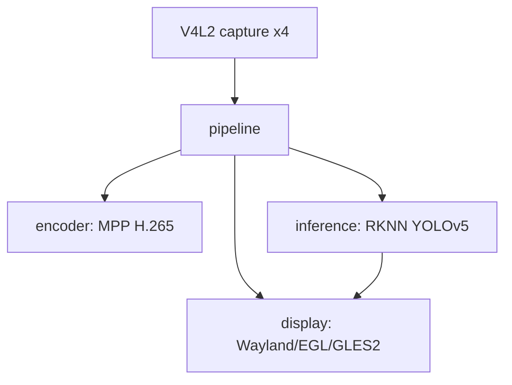
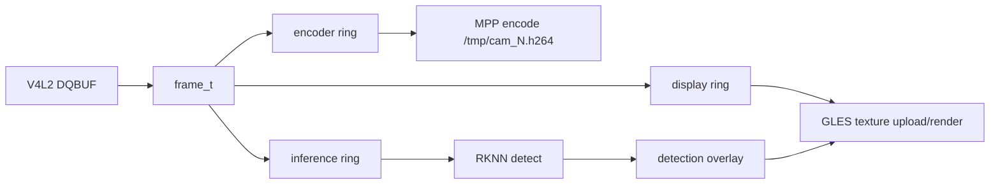
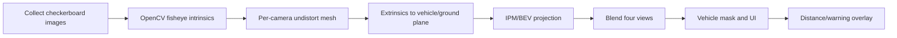

# Architecture

## Overview

The application is a multi-threaded C/C++ program for RK3568. It captures four NV12 camera streams, displays them with GLES2, optionally encodes them with MPP, and runs RKNN inference in a round-robin worker.

## Modules

| File | Role |
|------|------|
| `src/capture.c` | V4L2 camera open/configure, MMAP buffers, dma_buf export |
| `src/pipeline.c` | Capture/display/encode/inference ring coordination |
| `src/display.c` | Wayland/EGL/GLES2 rendering, grid view, OEM AVM UI prototype, overlay drawing |
| `src/encoder.c` | MPP H.265/H.264 hardware encoder |
| `src/inference.cc` | RKNN YOLOv5 inference and optional preprocessing path |
| `src/postprocess.cc` | YOLO postprocess, NMS, coordinate conversion |
| `src/fisheye_mesh.c` | Fisheye mesh generation prototype for later calibrated correction |
| `src/frame.h` | `frame_t` and SPSC ring buffer definitions |

## Data Flow

## Display Modes

| Mode | Entry | Current state |
|------|-------|---------------|
| 2x2 grid | Default | Stable display mode for four cameras |
| OEM AVM UI | `OEM_AVM_MODE=1` or `/userdata/start_avm.sh` | UI prototype with view switching and assist lines |
| Fisheye/mesh path | Code-level prototype | Needs formal calibration before becoming production display |

The current AVM UI should be treated as an interaction and visual prototype. It does not yet perform calibrated fisheye undistortion, BEV/IPM bird-view projection, or seamless four-camera stitching.

## Encoder Path

MPP encoding runs per camera. It is useful for recording or downstream streaming, but it competes for memory bandwidth with V4L2 capture, GPU display and NPU inference. For debugging display or AVM UI, prefer `--no-enc`.

## Inference Path

The inference worker takes frames from the pipeline, preprocesses them for the RKNN YOLOv5 model, runs detection, filters for persons, and publishes detection boxes to the display loop.

Current behavior:

- Four channels are scheduled round-robin.
- Person-only detection is the main demo target.
- Boxes are drawn in grid view and selected AVM views.
- Real distance estimation is not available until calibration and ground-plane mapping are implemented.

## Factory AVM Reference Findings

The board's factory AVM stack uses a more complete route:

- camera/lens calibration data
- GPU mesh/shader mapping
- vehicle-relative geometry
- top-down or 3D view composition
- UI overlay and warning guides

Our project reuses the same broad idea of GPU-side rendering, but it does not yet have the calibration dataset and geometry needed to match factory AVM behavior.

## Planned Real AVM Route

This route is required for a convincing 360 view and for person distance estimation.
